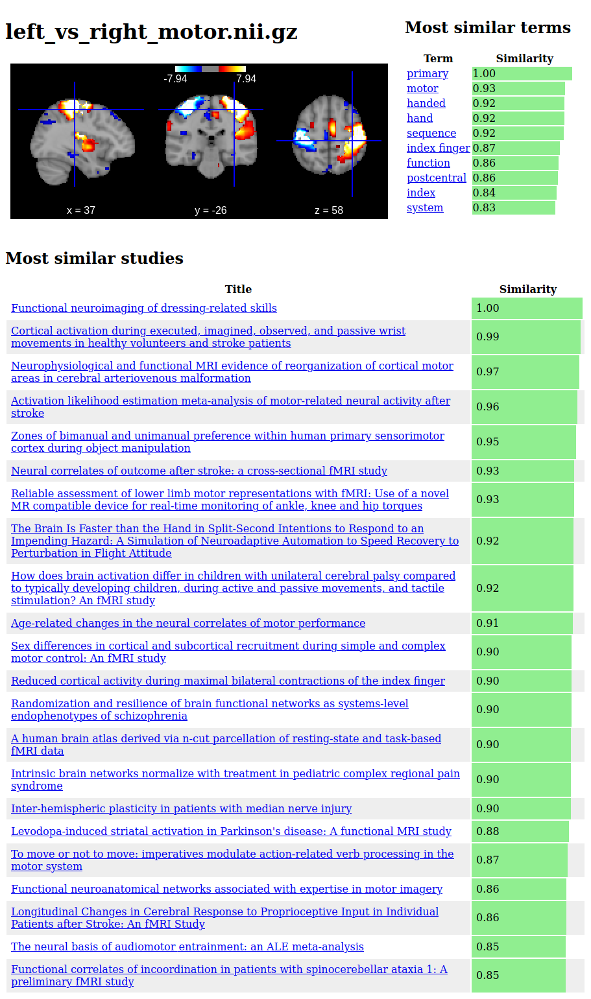

`neuroquery_image_search` is a Python package and command-line tool to search
the [NeuroQuery dataset](https://neuroquery.org) with a brain image.

While NeuroQuery accepts text as an input and produces a predicted brain image
and list of related studies, NeuroQuery Image Search takes an *image* as input
and produces a list of studies that report activation patterns similar to that
image. It also returns a list of terms whose NeuroQuery maps are similar to the
input image.

Unlike NeuroQuery, NeuroQuery Image Search isn't hosted anywhere online. However
we provide a [Voilà](https://github.com/voila-dashboards/voila) dashboard that
can be run for example on `mybinder` by following [this
link](https://mybinder.org/v2/gh/neuroquery/neuroquery_apps/master?urlpath=%2Fvoila%2Frender%2Fimage_search.py),
or locally by cloning [this
repository](https://github.com/neuroquery/neuroquery_apps).

At the end of this document is a screenshot of what NeuroQuery Image Search
output looks like.

# Requirements

NeuroQuery Image Search requires Python 3, `nilearn`, `matplotlib`, `jinja2` and
their dependencies.

# Installation

`pip install neuroquery_image_search`

# Usage

## As a command-line tool

After installing the package, the `neuroquery_image_search` command is available:

`neuroquery_image_search /path/to/my_image.nii.gz`

More detailed usage info: `neuroquery_image_search -h`

```
usage: neuroquery_image_search [-h] [--n_studies N_STUDIES] [--n_terms N_TERMS] [-o OUTPUT] [--transform {absolute_value,identity,positive_part}]
                               [query_img]

positional arguments:
  query_img             Nifti image with which to query the dataset. If not provided, an example image is downloaded from neurovault.org.
                        (default: None)

optional arguments:
  -h, --help            show this help message and exit
  --n_studies N_STUDIES
                        Number of similar studies returned (default: 50)
  --n_terms N_TERMS     Number of similar terms returned (default: 20)
  -o OUTPUT, --output OUTPUT
                        File in which to store the output. If not specified, output is displayed in a web browser. Output format depends on the
                        filename extension (.html or .json) (default: None)
  --transform {absolute_value,identity,positive_part}
                        Transform to apply to the image. As NeuroQuery ignores the direction of activations by default the absolute value of the
                        input map is compared to activation patterns in the literature. (default: absolute_value)
```

## As a Python package

```python
from nilearn.datasets import fetch_neurovault_motor_task
from neuroquery_image_search import NeuroQueryImageSearch, results_to_html


search = NeuroQueryImageSearch()
img = fetch_neurovault_motor_task()["images"][0]
results = search(img)
results_to_html(results, "Left vs Right Motor").open_in_browser()
```

# Reference

If you wish to refer to NeuroQuery Image Search please cite:

> Dockès J, Poldrack RA, Primet R, Gözükan H, Yarkoni T, Suchanek F, Thirion B, Varoquaux G. NeuroQuery, comprehensive meta-analysis of human brain mapping. Elife. 2020 Mar 4;9:e53385.

bibtex:

```
@article{dockes2020neuroquery,
  title={NeuroQuery, comprehensive meta-analysis of human brain mapping},
  author={Dock{\`e}s, J{\'e}rôme and Poldrack, Russell A and Primet, Romain and G{\"o}z{\"u}kan, Hande and Yarkoni, Tal and Suchanek, Fabian and Thirion, Bertrand and Varoquaux, Ga{\"e}l},
  journal={Elife},
  volume={9},
  pages={e53385},
  year={2020},
  publisher={eLife Sciences Publications Limited}
}
```
# Example output

<p></p>
